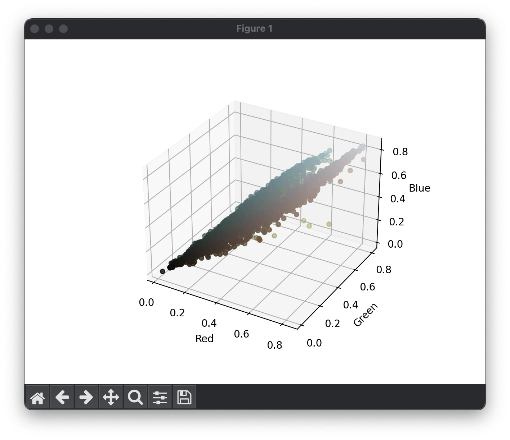
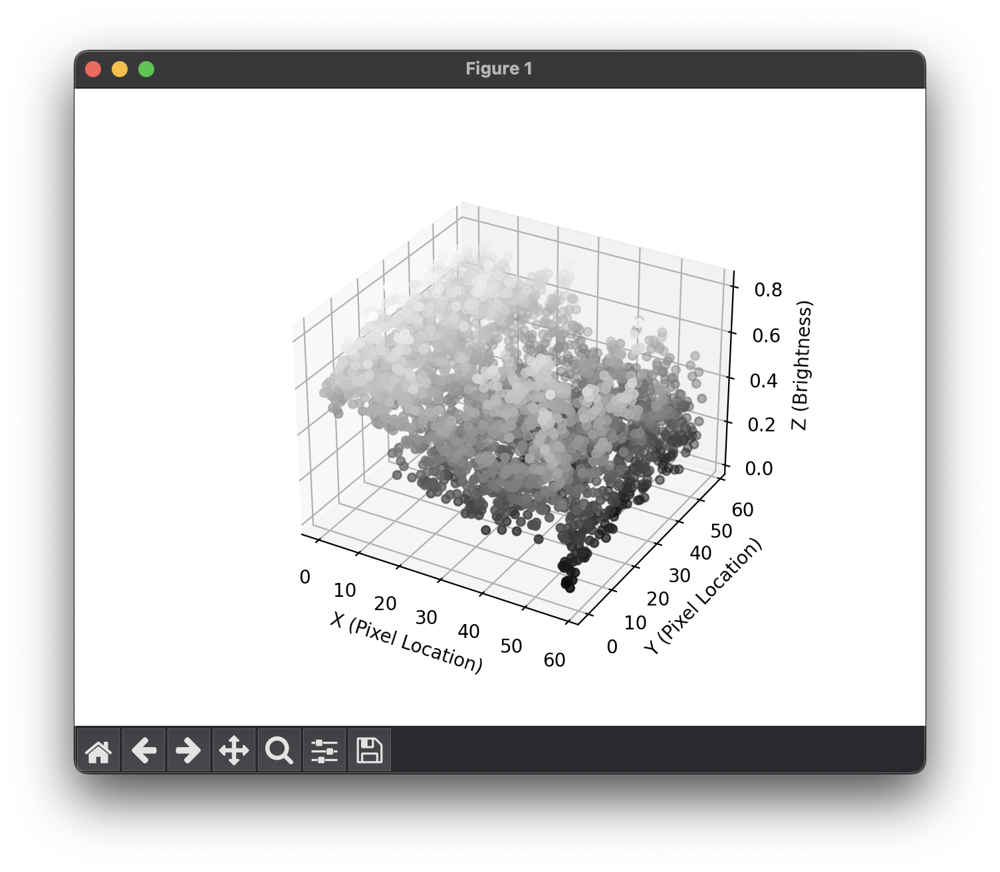
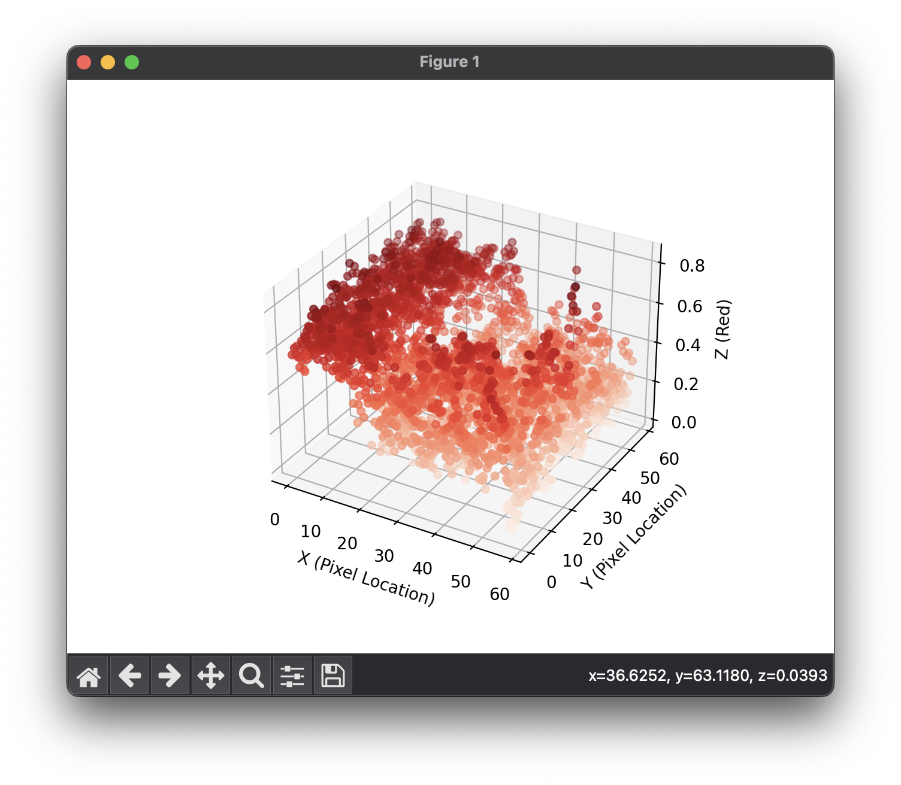
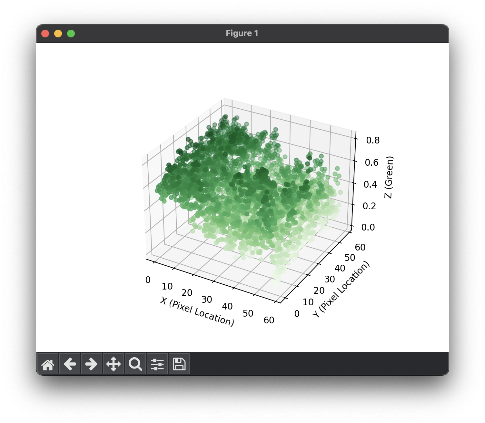
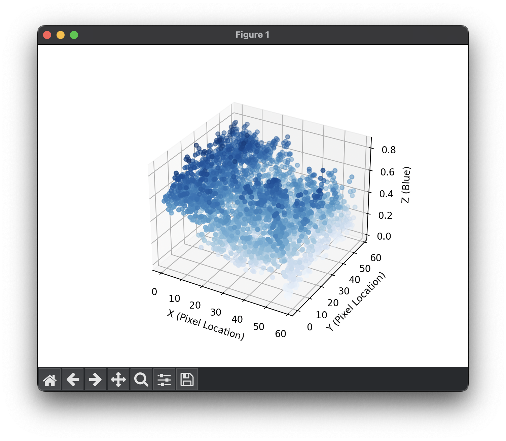
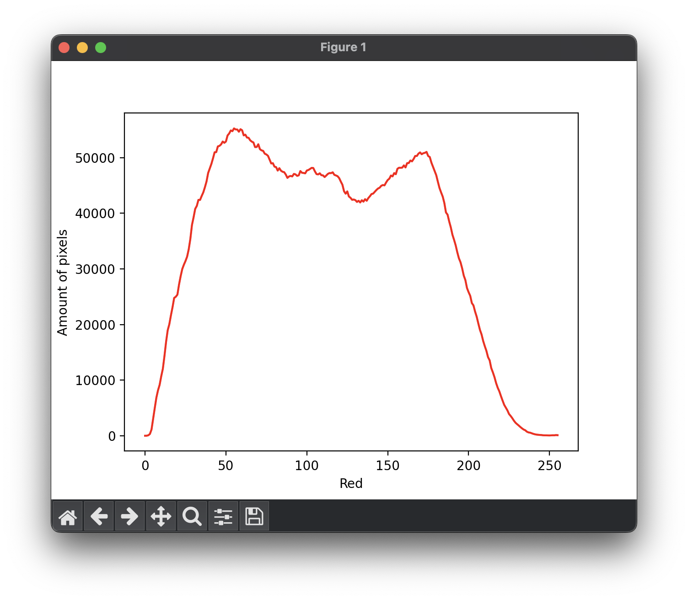
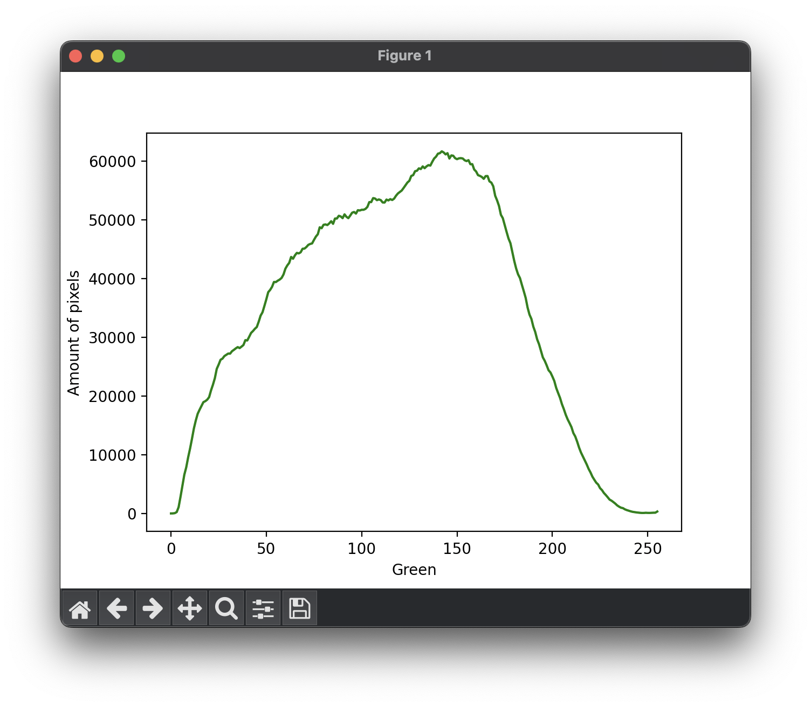
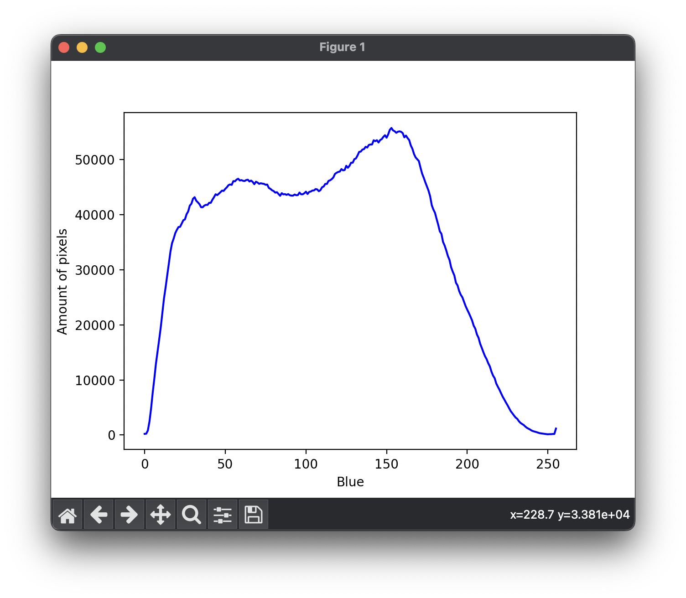
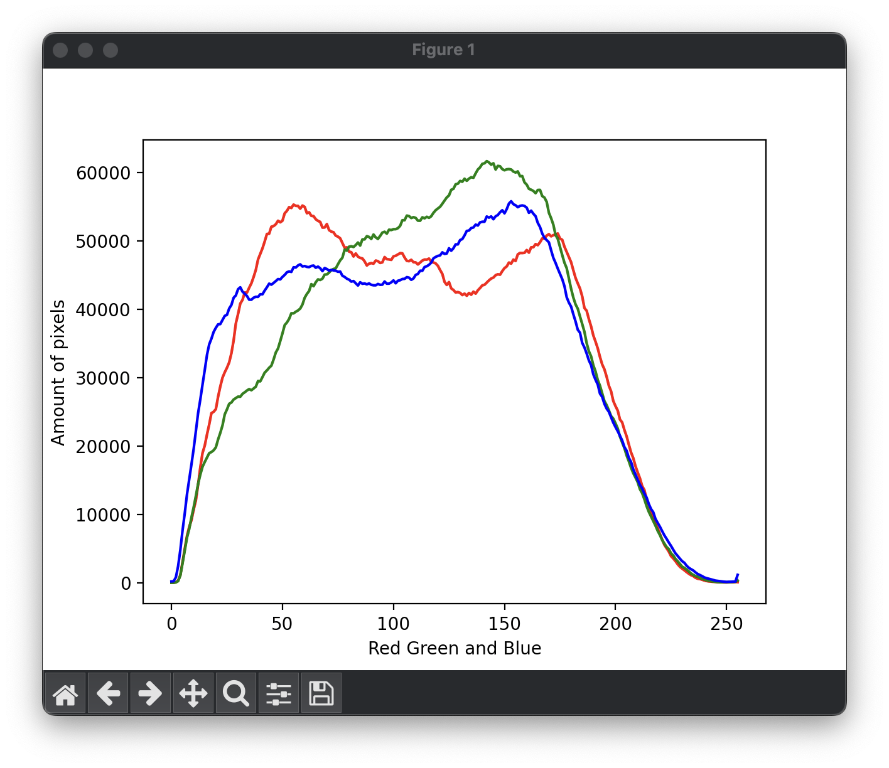

# ImgVis

Visualize images with graphs

## 3D Functions

Each function has the following parameters:
- image (str): The path to the image.
- compression (int): The compression of the image. This is the times that the image is compressed. The higher the compression, the faster the function will run, but the less accurate the graph will be. The default value is 0 which means that the image will not be compressed.

### Colour 3D



Visualize the colour of the image in 3D space. The x-axis is the red channel, the y-axis is the green channel and the z-axis is the blue channel.

```python

import ImgVis

ImgVis.colour_3d("example.png", compression=10)
```

### Brightness 3D



Visualize the brightness of the image in 3D space. The x-axis is the red channel, the y-axis is the green channel and the z-axis is the blue channel.

```python
import ImgVis

ImgVis.brightness_3d("example.png", compression=10)
```

### Red 3D




Visualize the red channel of the image in 3D space. The x-axis is the red channel, the y-axis is the green channel and the z-axis is the blue channel.

```python
import ImgVis

ImgVis.red_3d("example.png", compression=10)
```

### Green 3D



Visualize the green channel of the image in 3D space. The x-axis is the red channel, the y-axis is the green channel and the z-axis is the blue channel.

```python
import ImgVis

ImgVis.green_3d("example.png", compression=10)
```

### Blue 3D



Visualize the blue channel of the image in 3D space. The x-axis is the red channel, the y-axis is the green channel and the z-axis is the blue channel.

```python
import ImgVis

ImgVis.blue_3d("example.png", compression=10)
```

## 2D Functions

The 2D functions have the following parameters:
- image (str): The path to the image

### Red Line 2D



Visualize the red channel of the image in 2D space. The x-axis is the red channel and the y-axis is the green channel.

```python
import ImgVis

ImgVis.red_line_2d("example.png")
```

### Green Line 2D



Visualize the green channel of the image in 2D space. The x-axis is the red channel and the y-axis is the green channel.

```python
import ImgVis

ImgVis.green_line_2d("example.png")
```

### Blue Line 2D



Visualize the blue channel of the image in 2D space. The x-axis is the red channel and the y-axis is the green channel.

```python
import ImgVis

ImgVis.blue_line_2d("example.png")
```

### Combined Line 2D



Visualize the red, green and blue channel of the image in 2D space. The x-axis is the red channel and the y-axis is the green channel.

```python
import ImgVis

ImgVis.combined_line_2d("example.png")
```

## Licence

This project is licenced under the GNU General Public License v3.0. See the [LICENCE](LICENCE) file for more information.